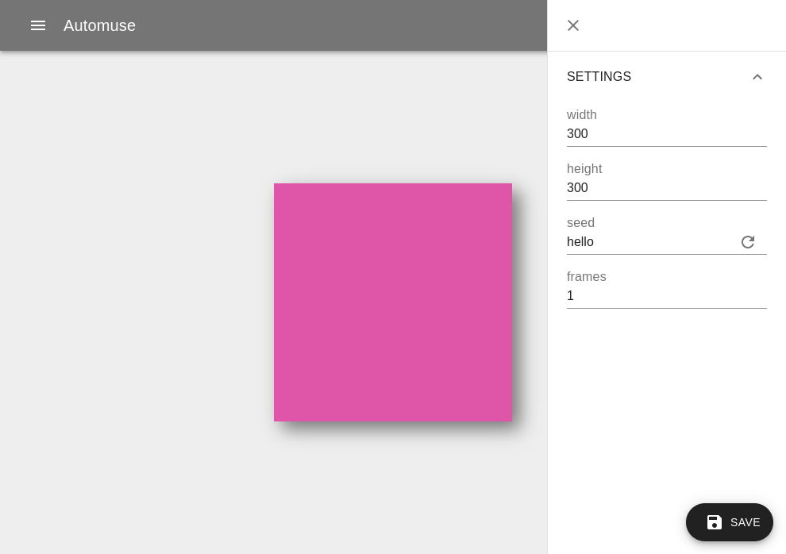
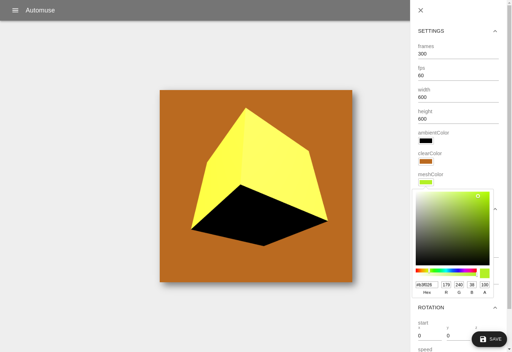
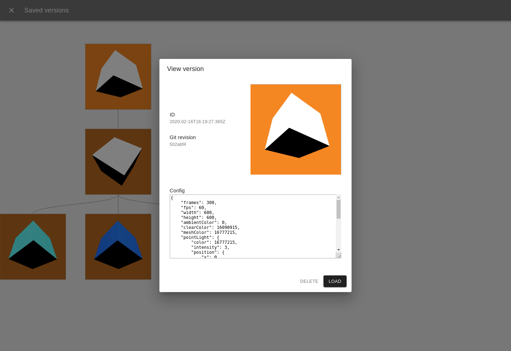

# Automuse

*Warning: This is very unfinished software, use at your own risk!*

* Automatic UI generation
* Uses Parcel bundler with hot-reloading
* Save sketches and export renders from the UI

You can run Automuse with the `--template` flag to create your sketch based on a template (`canvas`, `three`, or `random`) or you can start from scratch.

```bash
npx automuse --template=random sketch.js
```

Every sketch has two exports, `config` and `Sketch`. Here's the `random` template for a simple example:

```js
export const config = {
	width: 300,
	height: 300,
	seed: 'hello',
	frames: 1,
};

export class Sketch {
	constructor({ canvas }) {
		this.ctx = canvas.getContext('2d');
	}

	render({ width, height, random }) {
		const r = random() * 255,
			g = random() * 255,
			b = random() * 255;

		this.ctx.fillStyle = `rgba(${r}, ${g}, ${b}, 1.0)`;
		this.ctx.fillRect(0, 0, width, height);
	}
}
```

Running Automuse with this sketch will generate the following UI:



You can put whatever you like in the config object and Automuse will automatically generate a UI for it, so you can experiment interactively to find pleasing values. For example here's the `three` template:



## Config

Some keys in the config object have special significance:

| Key  | Description | Default |
| ---- | ----------- | ------- |
| `width` _(required)_  | Width of the canvas | - |
| `height` _(required)_ | Height of the canvas | - |
| `frames` | Number of frames to export | 300 |
| `fps` | Frames per second when exporing | 30 |
| `exportWorkers` | Number of Web Workers for exporting | 4 |
| `seed` | Seed value for random function | "hello" |

The config object is provided to each sketch method as well as some extra values:

* `frame`: The frame number (starting at 0) since the sketch started.
* `time`: The time in seconds since the sketch started.
* `random`: A function you can call to get RNG values based on the configured seed.

## Versions

At any time you can click the "Save" button to store a snapshot of the current config, a thumbnail, and the Git revision of your code.

The "View versions" screen shows all saved versions for the current sketch and allows you to view, load, and delete them. They are presented in a graph so it's super easy to keep track of your experimentation.



## Exporting

Clicking on the "Export render" entry in the menu will allow you to choose between a few formats:

* PNG: If your sketch has multiple frames this will return a zip file of the frames named like 00000.png, 00001.png etc. (relies on the `zip` program being installed).
* GIF: Relies on `ffmpeg` being installed.
* MP4: Relies on `ffmpeg` being installed.

## Similar projects

Automuse was mostly inspired by [canvas-sketch](https://github.com/mattdesl/canvas-sketch) and also bears many similarities to [Processing](https://processing.org/) / [p5.js](https://p5js.org/) and the like.

## License

Copyright 2019 Bobweb Ltd

Permission is hereby granted, free of charge, to any person obtaining a copy of this software and associated documentation files (the "Software"), to deal in the Software without restriction, including without limitation the rights to use, copy, modify, merge, publish, distribute, sublicense, and/or sell copies of the Software, and to permit persons to whom the Software is furnished to do so, subject to the following conditions:

The above copyright notice and this permission notice shall be included in all copies or substantial portions of the Software.

THE SOFTWARE IS PROVIDED "AS IS", WITHOUT WARRANTY OF ANY KIND, EXPRESS OR IMPLIED, INCLUDING BUT NOT LIMITED TO THE WARRANTIES OF MERCHANTABILITY, FITNESS FOR A PARTICULAR PURPOSE AND NONINFRINGEMENT. IN NO EVENT SHALL THE AUTHORS OR COPYRIGHT HOLDERS BE LIABLE FOR ANY CLAIM, DAMAGES OR OTHER LIABILITY, WHETHER IN AN ACTION OF CONTRACT, TORT OR OTHERWISE, ARISING FROM, OUT OF OR IN CONNECTION WITH THE SOFTWARE OR THE USE OR OTHER DEALINGS IN THE SOFTWARE.
